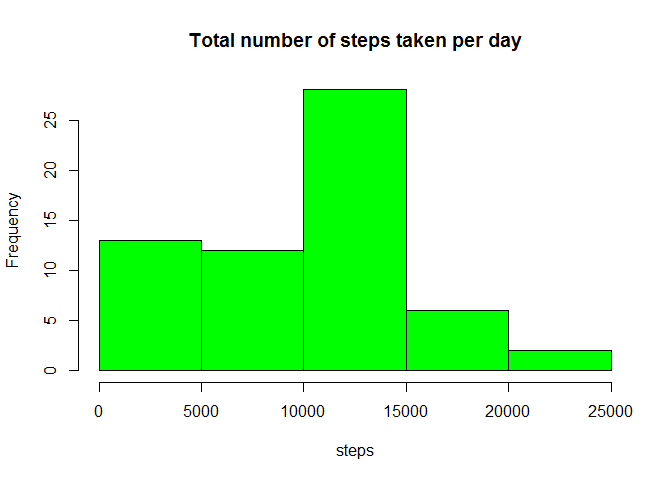
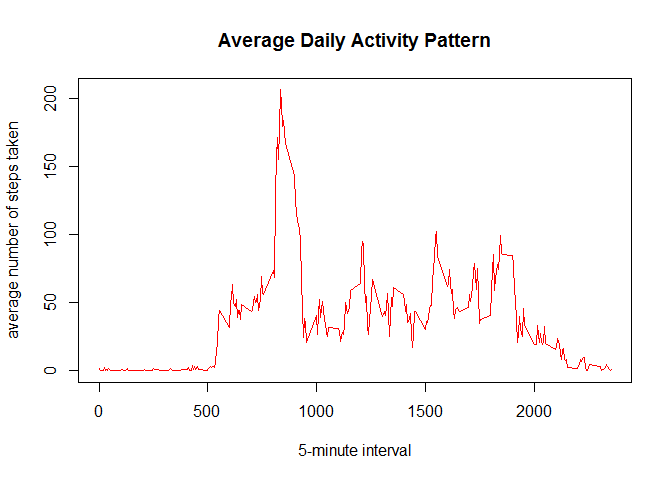
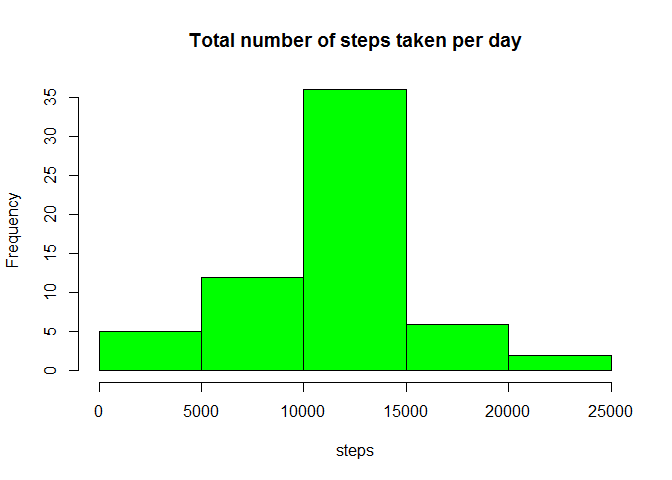
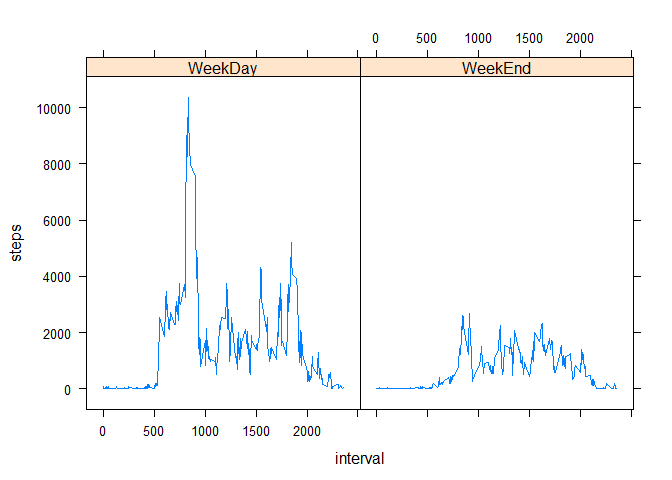

# Reproducible Research: Peer Assessment 1
Jan 8 2016  


```r
library(dplyr)
```

```
## 
## Attaching package: 'dplyr'
## 
## The following objects are masked from 'package:stats':
## 
##     filter, lag
## 
## The following objects are masked from 'package:base':
## 
##     intersect, setdiff, setequal, union
```

```r
library(lattice)
library(lubridate)
```

```
## Warning: package 'lubridate' was built under R version 3.2.3
```


## Loading and preprocessing the data


```r
setwd("~/JH/C5 - Reproducible Research/project/pro1")

fileURL <- "https://d396qusza40orc.cloudfront.net/repdata%2Fdata%2Factivity.zip"
download.file(fileURL, destfile="Act_Mon_Data.zip")
unzip("Act_Mon_data.zip", overwrite=TRUE)

data_df<- read.csv("activity.csv", header=TRUE, sep=",")
str(data_df)
```

```
## 'data.frame':	17568 obs. of  3 variables:
##  $ steps   : int  NA NA NA NA NA NA NA NA NA NA ...
##  $ date    : Factor w/ 61 levels "2012-10-01","2012-10-02",..: 1 1 1 1 1 1 1 1 1 1 ...
##  $ interval: int  0 5 10 15 20 25 30 35 40 45 ...
```


* Dataset: [Activity monitoring data](https://d396qusza40orc.cloudfront.net/repdata%2Fdata%2Factivity.zip) [52K]

This data set was downnloaded on 2016-Jan-11, and has a total of 17568 observations.

The variables included in this dataset are:

* **steps**: Number of steps taking in a 5-minute interval (missing values are coded as `NA`)

* **date**: The date on which the measurement was taken in YYYY-MM-DD format

* **interval**: Identifier for the 5-minute interval in which measurement was taken


```r
data_df$date <- as.Date(data_df$date, "%Y-%m-%d")

# data_df$date is a factor variable, changing the class type to 'Date'
str(data_df)
```

```
## 'data.frame':	17568 obs. of  3 variables:
##  $ steps   : int  NA NA NA NA NA NA NA NA NA NA ...
##  $ date    : Date, format: "2012-10-01" "2012-10-01" ...
##  $ interval: int  0 5 10 15 20 25 30 35 40 45 ...
```


## What is mean total number of steps taken per day?
For this part of the assignment, you can ignore the missing values in the dataset, therefore the na.rm parameter must be set equal to TRUE.


1. Calculate the total number of steps taken per day

```r
DailyTotalSteps <- data_df %>%  # dplyr package already loaded
    group_by(date) %>%
    summarise(stepCount = sum(steps, na.rm = TRUE))

head(DailyTotalSteps)
```

```
## Source: local data frame [6 x 2]
## 
##         date stepCount
##       (date)     (int)
## 1 2012-10-01         0
## 2 2012-10-02       126
## 3 2012-10-03     11352
## 4 2012-10-04     12116
## 5 2012-10-05     13294
## 6 2012-10-06     15420
```

```r
str(DailyTotalSteps)
```

```
## Classes 'tbl_df', 'tbl' and 'data.frame':	61 obs. of  2 variables:
##  $ date     : Date, format: "2012-10-01" "2012-10-02" ...
##  $ stepCount: int  0 126 11352 12116 13294 15420 11015 0 12811 9900 ...
```


2. Make a histogram of the total number of steps taken each day

```r
with(DailyTotalSteps, hist(stepCount, main = "Total number of steps taken per day", 
                           col = "green", xlab = "steps"))
```

 


3. Calculate and report the **mean** and **median** of the total number of steps taken per day


```r
mean_steps <- mean(DailyTotalSteps$stepCount)
median_steps <- median(DailyTotalSteps$stepCount)
```
The **mean** of the total number of steps taken per day is 9354.2295082 and the *median** is 10395. 


## What is the average daily activity pattern?

1. Make a time series plot (i.e. `type = "l"`) of the 5-minute interval (x-axis) and the average number of steps taken, averaged across all days (y-axis)


```r
avgdailypattern <- data_df %>%  # dplyr package already loaded
    group_by(interval) %>%
    summarise(avgSteps = mean(steps, na.rm = TRUE))


plot(avgdailypattern$interval, avgdailypattern$avgStep,
     type="l", 
     col="red",
     xlab="5-minute interval",
     ylab="average number of steps taken",
     main= "Average Daily Activity Pattern")
```

 


2. Which 5-minute interval, on average across all the days in the dataset, contains the maximum number of steps?


```r
# The which.max function returns the row# of the highest average number of steps.Then, use this row# to find out the corresonding 5-min interval.

row_no <- which.max(avgdailypattern$avgStep)
FiveMinInt <- avgdailypattern$interval[row_no]
```
The 5-minute interval having the max number of steps is 835, as shown by the "Average Daily Activity Pattern" plot.  The highest average number of steps taken is 206.1698113.


## Imputing missing values

Note that there are a number of days/intervals where there are missing values (coded as `NA`).
The presence of missing days may introduce bias into some calculations or summaries of the data.


1. Calculate and report the total number of missing values in the dataset (i.e. the total number of rows with `NA`s)

```r
NA_TotalCount <- sum(is.na(data_df$steps))

NA_Percentage <- sum(is.na(data_df$steps)/nrow(data_df)) * 100
```
There are  2304 missing values coded as NA, accounting for 13.1147541 pecentage of the total observations.


2. Devise a strategy for filling in all of the missing values in the dataset. The strategy does not need to be sophisticated.
For example, you could use the mean/median for that day, or the mean for that 5-minute interval, etc.

*strategy used :*  
* will be using the mean for that 5-min interval to fill in the NA / missing values.
* to merge the downloaded 'Activity' and 'avgdailypattern', which we calculated earlier; dataframes using common key 'Interval'.


3. Create a new dataset that is equal to the original dataset but with the missing data filled in.


```r
No_NA_DF <- merge(data_df, avgdailypattern, by="interval")

str(No_NA_DF)
```

```
## 'data.frame':	17568 obs. of  4 variables:
##  $ interval: int  0 0 0 0 0 0 0 0 0 0 ...
##  $ steps   : int  NA 0 0 0 0 0 0 0 0 0 ...
##  $ date    : Date, format: "2012-10-01" "2012-11-23" ...
##  $ avgSteps: num  1.72 1.72 1.72 1.72 1.72 ...
```

```r
#This loop replaces NAs in the *steps* column with the value in the *avgSteps* column in the same row.

for (i in 1:nrow(No_NA_DF)) {
    if (is.na(No_NA_DF$steps[i])==TRUE) {
        No_NA_DF$steps[i] <- No_NA_DF$avgSteps[i]
    }
}

NA_TotalCount1 <- sum(is.na(No_NA_DF$steps))
```
Is there any more missing values NA after filling? 0


4. Make a histogram of the total number of steps taken each day and Calculate and report the **mean** and **median** total number of steps taken per day. Do these values differ from the estimates from the first part of the assignment? What is the impact of imputing missing data on the estimates of the total daily number of steps?


```r
# alike question 1:

DailyTotalSteps1 <- No_NA_DF  %>%  # dplyr package already loaded
    group_by(date) %>%
    summarise(stepCount = sum(steps, na.rm = TRUE))


with(DailyTotalSteps1, hist(stepCount, main = "Total number of steps taken per day", 
                           col = "green", xlab = "steps"))
```

 

```r
mean_steps1 <- mean(DailyTotalSteps1$stepCount)
median_steps1 <- median(DailyTotalSteps1$stepCount)
```
The **mean** of the total number of steps taken per day is 1.0766189\times 10^{4} and the **median** is 1.0766189\times 10^{4}. 


## Are there differences in activity patterns between weekdays and weekends?


1. Create a new factor variable in the dataset with two levels -- "weekday" and "weekend" indicating whether a given date is a weekday or weekend day.


```r
# lubridate package already loaded
No_NA_DF <- mutate(No_NA_DF, typeDate = ifelse(wday(date) == 1 | wday(date) == 7, "WeekEnd", "WeekDay"))
No_NA_DF$typeDate <- as.factor(No_NA_DF$typeDate)
```


1. Make a panel plot containing a time series plot (i.e. `type = "l"`) of the 5-minute interval (x-axis) and the average number of steps taken, averaged across all weekday days or weekend days (y-axis). The plot should look something like the following, which was created using **simulated data**:


```r
No_NA_DF_typeDate <- No_NA_DF %>% 
  group_by(typeDate, interval) %>% 
  summarise(steps = sum(steps))

with(No_NA_DF_typeDate, xyplot(steps ~ interval | typeDate, type = "l", layout = c(2, 1)))
```

 

